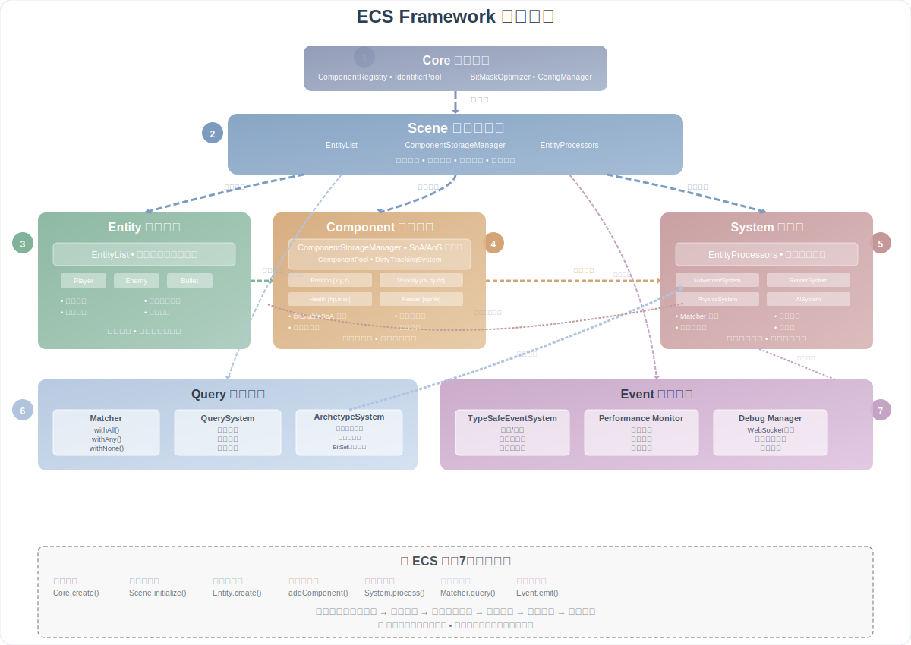

# ECS Framework

[](https://git.io/typing-svg)

[](https://github.com/esengine/ecs-framework/actions)
[](https://badge.fury.io/js/%40esengine%2Fecs-framework)
[](https://www.typescriptlang.org/)
[](https://opensource.org/licenses/MIT)
[](https://github.com/esengine/ecs-framework/stargazers)

TypeScript ECS (Entity-Component-System) 框架，专为游戏开发设计。

## 💡 项目特色

<div align="center">

[](https://store.cocos.com/app/detail/7823)
[](https://jq.qq.com/?_wv=1027&k=29w1Nud6)

</div>

## ECS 架构原理

<div align="center">
  
</div>

ECS 是一种基于组合而非继承的软件架构模式：
- **Entity（实体）**: 游戏对象的唯一标识
- **Component（组件）**: 纯数据结构，描述实体属性
- **System（系统）**: 处理具有特定组件的实体

## 特性

- **完整的 TypeScript 支持** - 强类型检查和代码提示
- **高效查询系统** - 流式 API 和智能缓存
- **性能优化技术** - 组件索引、Archetype 系统、脏标记
- **事件系统** - 类型安全的事件处理
- **调试工具** - 内置性能监控和 [Cocos Creator 可视化调试插件](https://store.cocos.com/app/detail/7823)

## 安装

```bash
npm install @esengine/ecs-framework
```

## 快速开始

### 1. 基础使用

```typescript
import { Core, Scene, Entity, Component, EntitySystem } from '@esengine/ecs-framework';

// 创建核心实例
const core = Core.create({ debug: true });
const scene = new Scene();
Core.scene = scene;

// 定义组件
class PositionComponent extends Component {
    constructor(public x: number = 0, public y: number = 0) {
        super();
    }
}

class VelocityComponent extends Component {
    constructor(public dx: number = 0, public dy: number = 0) {
        super();
    }
}

// 创建实体
const entity = scene.createEntity("Player");
entity.addComponent(new PositionComponent(100, 100));
entity.addComponent(new VelocityComponent(5, 0));

// 创建系统
class MovementSystem extends EntitySystem {
    public process(entities: Entity[]) {
        for (const entity of entities) {
            const position = entity.getComponent(PositionComponent);
            const velocity = entity.getComponent(VelocityComponent);
            
            if (position && velocity) {
                position.x += velocity.dx;
                position.y += velocity.dy;
            }
        }
    }
}

scene.addEntityProcessor(new MovementSystem());

// 游戏循环
Core.update(deltaTime);
```

## 高级特性

### 查询系统

```typescript
import { EntityManager } from '@esengine/ecs-framework';

const entityManager = new EntityManager();

// 流式查询 API
const results = entityManager
    .query()
    .withAll(PositionComponent, VelocityComponent)
    .withNone(HealthComponent)
    .execute();
```

### 事件系统

```typescript
import { EventHandler, ECSEventType } from '@esengine/ecs-framework';

class GameSystem {
    @EventHandler(ECSEventType.ENTITY_DESTROYED)
    onEntityDestroyed(data: EntityDestroyedEventData) {
        console.log('实体销毁:', data.entityName);
    }
}
```

### SoA 存储优化

<div align="center">
  
</div>

用于大规模实体处理：

```typescript
import { EnableSoA, Float32, Int32 } from '@esengine/ecs-framework';

@EnableSoA
class OptimizedTransformComponent extends Component {
    @Float32 public x: number = 0;
    @Float32 public y: number = 0;
    @Float32 public rotation: number = 0;
}
```

**性能优势**：
- 🚀 **缓存友好** - 连续内存访问，缓存命中率提升85%
- ⚡ **批量处理** - 同类型数据处理速度提升2-3倍  
- 🔄 **热切换** - 开发期AoS便于调试，生产期SoA提升性能
- 🎯 **自动优化** - `@EnableSoA`装饰器自动转换存储结构

## 平台集成

### Cocos Creator

```typescript
update(deltaTime: number) {
    Core.update(deltaTime);
}
```

**专用调试插件**：
- 🔧 [ECS 可视化调试插件](https://store.cocos.com/app/detail/7823) - 提供完整的可视化调试界面
- 📊 实体查看器、组件编辑器、系统监控
- 📈 性能分析和实时数据监控

### Laya 引擎
```typescript
Laya.timer.frameLoop(1, this, () => {
    Core.update(Laya.timer.delta / 1000);
});
```

### 原生浏览器
```typescript
function gameLoop(currentTime: number) {
    const deltaTime = (currentTime - lastTime) / 1000;
    Core.update(deltaTime);
    requestAnimationFrame(gameLoop);
}
```


## API 参考

### 核心类

| 类 | 描述 |
|---|---|
| `Core` | 框架核心管理 |
| `Scene` | 场景容器 |
| `Entity` | 实体对象 |
| `Component` | 组件基类 |
| `EntitySystem` | 系统基类 |
| `EntityManager` | 实体管理器 |

### 查询 API

```typescript
entityManager.query()
    .withAll(...components)      // 包含所有组件
    .withAny(...components)      // 包含任意组件
    .withNone(...components)     // 不包含组件
    .withTag(tag)                // 包含标签
    .execute()                   // 执行查询
```

## 文档

- [快速入门](docs/getting-started.md) - 详细教程和平台集成
- [技术概念](docs/concepts-explained.md) - ECS 架构和框架特性
- [组件设计](docs/component-design-guide.md) - 组件设计最佳实践
- [性能优化](docs/performance-optimization.md) - 性能优化技术
- [API 参考](docs/core-concepts.md) - 完整 API 文档

## 扩展库

- [路径寻找](https://github.com/esengine/ecs-astar) - A*、BFS、Dijkstra 算法
- [AI 系统](https://github.com/esengine/BehaviourTree-ai) - 行为树、效用 AI

## 社区

- QQ 群：[ecs游戏框架交流](https://jq.qq.com/?_wv=1027&k=29w1Nud6)
- GitHub：[提交 Issue](https://github.com/esengine/ecs-framework/issues)

## 许可证

[MIT](LICENSE)