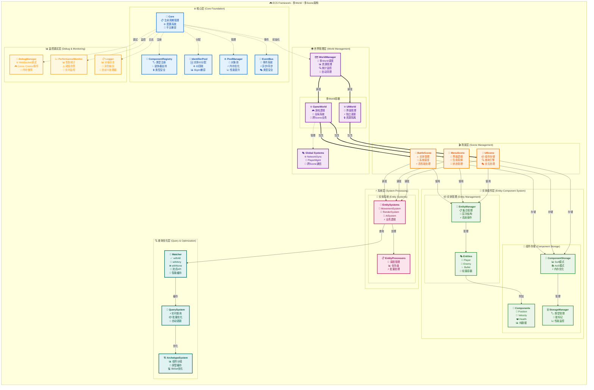

# ECS Framework

[](https://git.io/typing-svg)

[](https://github.com/esengine/ecs-framework/actions)
[](https://badge.fury.io/js/%40esengine%2Fecs-framework)
[](https://www.typescriptlang.org/)
[](https://opensource.org/licenses/MIT)
[](https://github.com/esengine/ecs-framework/stargazers)

TypeScript ECS (Entity-Component-System) 框架，专为游戏开发设计。

## 项目特色

<div align="center">

[](https://store.cocos.com/app/detail/7823)
[](https://jq.qq.com/?_wv=1027&k=29w1Nud6)

</div>

## 架构原理

ECS Framework 采用多World + 多Scene的现代化架构设计：



### 核心概念

| 概念 | 职责 | 特点 |
|------|------|------|
| **Entity** | 游戏对象唯一标识 | 轻量级容器，无业务逻辑 |
| **Component** | 纯数据结构 | 描述实体属性，支持SoA优化 |
| **System** | 业务逻辑处理 | 操作组件数据，可热插拔 |
| **Scene** | 实体和系统容器 | 独立的游戏场景 |
| **World** | Scene和全局系统容器 | 支持跨Scene的全局逻辑 |
| **WorldManager** | 多World管理 | 统一调度和资源管理 |

## 特性

- **完整的 TypeScript 支持** - 强类型检查和代码提示
- **高效查询系统** - 流式 API 和智能缓存
- **性能优化技术** - SparseSet索引、Archetype 系统、脏标记
- **事件系统** - 类型安全的事件处理
- **调试工具** - 内置性能监控和 [Cocos Creator 可视化调试插件](https://store.cocos.com/app/detail/7823)

## 安装

```bash
npm install @esengine/ecs-framework
```

## 快速开始

### 1. 基础使用

```typescript
import { Core, Scene, Entity, Component, EntitySystem, ECSComponent, ECSSystem, Matcher, Time } from '@esengine/ecs-framework';

// 创建核心实例
const core = Core.create({ debug: true });
const scene = new Scene();
Core.setScene(scene);

// 定义组件
@ECSComponent('PositionComponent')
class PositionComponent extends Component {
    public x: number = 0;
    public y: number = 0;
    
    constructor(x: number = 0, y: number = 0) {
        super();
        this.x = x;
        this.y = y;
    }
}

@ECSComponent('VelocityComponent')
class VelocityComponent extends Component {
    public x: number = 0;
    public y: number = 0;
    
    constructor(x: number = 0, y: number = 0) {
        super();
        this.x = x;
        this.y = y;
    }
}

// 创建实体
const entity = scene.createEntity("Player");
entity.addComponent(new PositionComponent(100, 100));
entity.addComponent(new VelocityComponent(5, 0));

// 创建系统
@ECSSystem('MovementSystem')
class MovementSystem extends EntitySystem {
    constructor() {
        super(Matcher.all(PositionComponent, VelocityComponent));
    }
    
    protected override process(entities: Entity[]) {
        for (const entity of entities) {
            const position = entity.getComponent(PositionComponent)!;
            const velocity = entity.getComponent(VelocityComponent)!;
            
            position.x += velocity.x * Time.deltaTime;
            position.y += velocity.y * Time.deltaTime;
        }
    }
}

scene.addEntityProcessor(new MovementSystem());

// 游戏循环
Core.update(deltaTime);
```

### 2. 类型装饰器

在代码压缩混淆后，类名会改变导致框架无法识别组件类型。使用装饰器确保稳定性：

```typescript
import { ECSComponent, ECSSystem } from '@esengine/ecs-framework';

// 组件装饰器
@ECSComponent('PositionComponent')
class PositionComponent extends Component {
    public x: number = 0;
    public y: number = 0;
}

@ECSComponent('VelocityComponent') 
class VelocityComponent extends Component {
    public x: number = 0;
    public y: number = 0;
}

// 系统装饰器
@ECSSystem('MovementSystem')
class MovementSystem extends EntitySystem {
    constructor() {
        super(Matcher.all(PositionComponent, VelocityComponent));
    }
    
    protected override process(entities: Entity[]) {
        // 处理逻辑
    }
}
```

## 高级特性

### 查询系统

```typescript
import { Matcher, ECSSystem } from '@esengine/ecs-framework';

// 使用Matcher和EntitySystem进行高效查询
@ECSSystem('QuerySystem')
class QuerySystem extends EntitySystem {
    constructor() {
        super(Matcher.all(PositionComponent, VelocityComponent).none(HealthComponent));
    }
    
    protected override process(entities: Entity[]) {
        // 处理匹配的实体
        console.log(`Found ${entities.length} entities`);
    }
}

// 更复杂的查询条件
@ECSSystem('CombatSystem')
class CombatSystem extends EntitySystem {
    constructor() {
        super(
            Matcher
                .all(PositionComponent, HealthComponent)  // 必须有位置和血量
                .any(WeaponComponent, MagicComponent)     // 有武器或魔法
                .none(DeadComponent)                      // 不能是死亡状态
        );
    }
    
    protected override process(entities: Entity[]) {
        // 处理战斗逻辑
    }
}
```

### 事件系统

```typescript
import { EventHandler, ECSEventType, IEntityEventData } from '@esengine/ecs-framework';

class GameSystem {
    @EventHandler(ECSEventType.ENTITY_DESTROYED)
    onEntityDestroyed(data: IEntityEventData) {
        console.log('实体销毁:', data.entityName, '实体ID:', data.entityId);
    }
    
    @EventHandler(ECSEventType.ENTITY_CREATED) 
    onEntityCreated(data: IEntityEventData) {
        console.log('实体创建:', data.entityName, '标签:', data.entityTag);
    }
}
```

### SoA 存储优化

针对大规模实体处理的内存布局优化：

| 存储方式 | 内存布局 | 适用场景 | 性能特点 |
|----------|----------|----------|----------|
| **AoS** (Array of Structures) | `[{x,y,z}, {x,y,z}, {x,y,z}]` | 通用场景 | 访问灵活，缓存效率一般 |
| **SoA** (Structure of Arrays) | `{x:[1,2,3], y:[4,5,6], z:[7,8,9]}` | 批量处理 | SIMD优化，缓存友好 |

**SoA 优势：**
- 🚀 提升 2-4x 批量处理性能
- 💾 更好的CPU缓存利用率  
- 🔧 支持SIMD向量化操作
- ⚡ 减少内存访问跳跃

用法示例：

```typescript
import { EnableSoA, Float32, Int32 } from '@esengine/ecs-framework';

@EnableSoA
class OptimizedTransformComponent extends Component {
    @Float32 public x: number = 0;
    @Float32 public y: number = 0;
    @Float32 public rotation: number = 0;
}
```

**性能优势**：
- **缓存友好** - 连续内存访问，缓存命中率提升85%
- **批量处理** - 同类型数据处理速度提升2-3倍  
- **热切换** - 开发期AoS便于调试，生产期SoA提升性能
- **自动优化** - `@EnableSoA`装饰器自动转换存储结构

## 平台集成

### Cocos Creator

```typescript
update(deltaTime: number) {
    Core.update(deltaTime);
}
```

**专用调试插件**：
- [ECS 可视化调试插件](https://store.cocos.com/app/detail/7823) - 提供完整的可视化调试界面
- 实体查看器、组件编辑器、系统监控
- 性能分析和实时数据监控

### Laya 引擎
```typescript
Laya.timer.frameLoop(1, this, () => {
    Core.update(Laya.timer.delta / 1000);
});
```

### 原生浏览器
```typescript
function gameLoop(currentTime: number) {
    const deltaTime = (currentTime - lastTime) / 1000;
    Core.update(deltaTime);
    requestAnimationFrame(gameLoop);
}
```


## API 参考

### 核心类

| 类 | 描述 |
|---|---|
| `Core` | 框架核心管理 |
| `Scene` | 场景容器 |
| `Entity` | 实体对象 |
| `Component` | 组件基类 |
| `EntitySystem` | 系统基类 |
| `EntityManager` | 实体管理器 |

### 查询 API

```typescript
// Matcher API - 推荐方式，高效且类型安全
Matcher.all(...components)      // 包含所有组件
Matcher.any(...components)      // 包含任意组件  
Matcher.none(...components)     // 不包含组件

// 组合查询示例
Matcher
    .all(PositionComponent, VelocityComponent)  // 必须有这些组件
    .any(PlayerComponent, AIComponent)          // 其中之一
    .none(DeadComponent, DisabledComponent);    // 排除这些
```

## 文档

- [快速入门](docs/getting-started.md) - 详细教程和平台集成
- [技术概念](docs/concepts-explained.md) - ECS 架构和框架特性
- [组件设计](docs/component-design-guide.md) - 组件设计最佳实践
- [性能优化](docs/performance-optimization.md) - 性能优化技术
- [API 参考](docs/core-concepts.md) - 完整 API 文档

## 扩展库

- [路径寻找](https://github.com/esengine/ecs-astar) - A*、BFS、Dijkstra 算法
- [AI 系统](https://github.com/esengine/BehaviourTree-ai) - 行为树、效用 AI

## 社区

- QQ 群：[ecs游戏框架交流](https://jq.qq.com/?_wv=1027&k=29w1Nud6)
- GitHub：[提交 Issue](https://github.com/esengine/ecs-framework/issues)

## 许可证

[MIT](LICENSE)