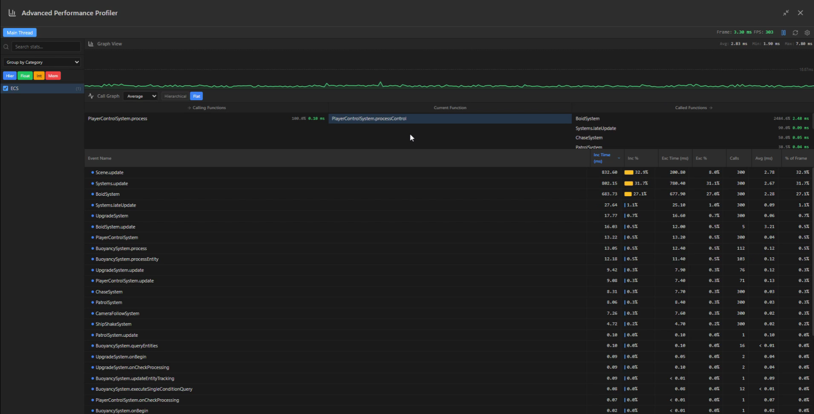
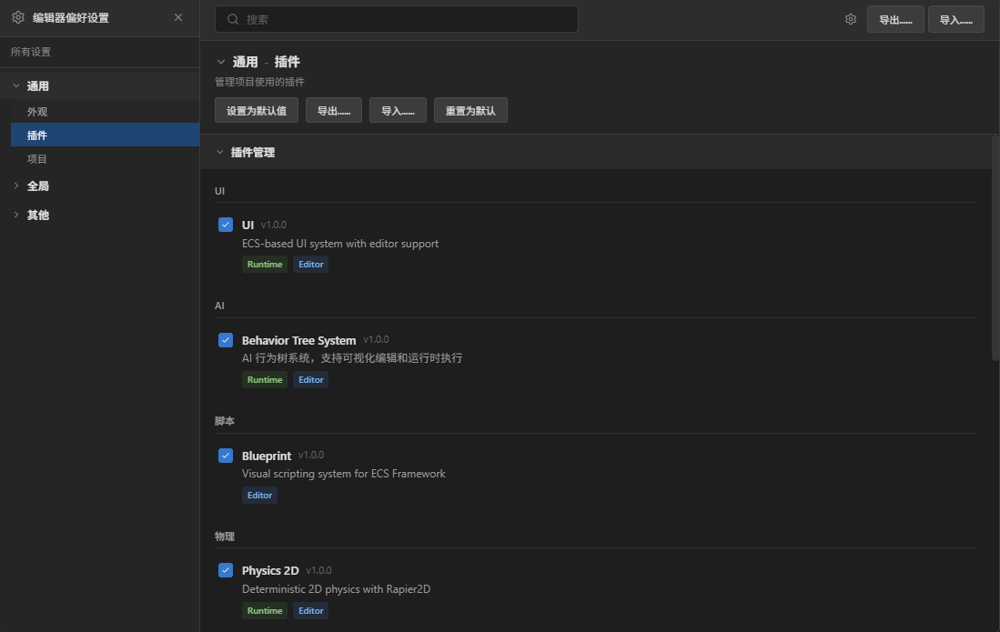
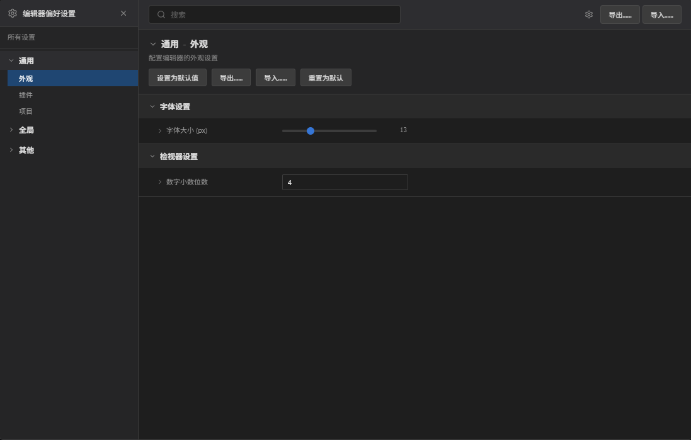

# ECS Framework

[](https://github.com/esengine/ecs-framework/actions)
[](https://codecov.io/gh/esengine/ecs-framework)
[](https://badge.fury.io/js/%40esengine%2Fecs-framework)
[](https://www.npmjs.com/package/@esengine/ecs-framework)
[](https://bundlephobia.com/package/@esengine/ecs-framework)
[](https://www.typescriptlang.org/)
[](https://opensource.org/licenses/MIT)
[](#contributors)
[](https://github.com/esengine/ecs-framework/stargazers)
[](https://deepwiki.com/esengine/ecs-framework)

一个高性能的 TypeScript ECS (Entity-Component-System) 框架，专为现代游戏开发而设计。

## 特性

- **高性能** - 针对大规模实体优化，支持SoA存储和批量处理
- **多线程计算** - Worker系统支持真正的并行处理，充分利用多核CPU性能
- **类型安全** - 完整的TypeScript支持，编译时类型检查
- **现代架构** - 支持多World、多Scene的分层架构设计
- **开发友好** - 内置调试工具和性能监控
- **跨平台** - 支持Cocos Creator、Laya引擎和Web平台

## 安装

```bash
npm install @esengine/ecs-framework
```

## 快速开始

```typescript
import { Core, Scene, Component, EntitySystem, ECSComponent, ECSSystem, Matcher, Time } from '@esengine/ecs-framework';

// 定义组件
@ECSComponent('Position')
class Position extends Component {
    constructor(public x = 0, public y = 0) {
        super();
    }
}

@ECSComponent('Velocity')
class Velocity extends Component {
    constructor(public dx = 0, public dy = 0) {
        super();
    }
}

// 创建系统
@ECSSystem('Movement')
class MovementSystem extends EntitySystem {
    constructor() {
        super(Matcher.all(Position, Velocity));
    }

    protected process(entities: readonly Entity[]): void {
        for (const entity of entities) {
            const position = entity.getComponent(Position)!;
            const velocity = entity.getComponent(Velocity)!;

            position.x += velocity.dx * Time.deltaTime;
            position.y += velocity.dy * Time.deltaTime;
        }
    }
}

// 创建场景并启动
class GameScene extends Scene {
    protected initialize(): void {
        this.addSystem(new MovementSystem());

        const player = this.createEntity("Player");
        player.addComponent(new Position(100, 100));
        player.addComponent(new Velocity(50, 0));
    }
}

// 启动游戏
Core.create();
Core.setScene(new GameScene());

// 游戏循环中更新
function gameLoop(deltaTime: number) {
    Core.update(deltaTime);
}
```

## 核心特性

- **实体查询** - 使用 Matcher API 进行高效的实体过滤
- **事件系统** - 类型安全的事件发布/订阅机制
- **性能优化** - SoA 存储优化，支持大规模实体处理
- **多线程支持** - Worker系统实现真正的并行计算，充分利用多核CPU
- **多场景** - 支持 World/Scene 分层架构
- **时间管理** - 内置定时器和时间控制系统

## 平台支持

支持主流游戏引擎和 Web 平台：

- **Cocos Creator**
- **Laya 引擎**
- **原生 Web** - 浏览器环境直接运行
- **小游戏平台** - 微信、支付宝等小游戏

## ECS Framework Editor

跨平台桌面编辑器，提供可视化开发和调试工具。

### 主要功能

- **场景管理** - 可视化场景层级和实体管理
- **组件检视** - 实时查看和编辑实体组件
- **性能分析** - 内置 Profiler 监控系统性能
- **插件系统** - 可扩展的插件架构
- **远程调试** - 连接运行中的游戏进行实时调试
- **自动更新** - 支持热更新，自动获取最新版本

### 下载

[](https://github.com/esengine/ecs-framework/releases/latest)

支持 Windows、macOS (Intel & Apple Silicon)

### 截图


<details>
<summary>查看更多截图</summary>

**性能分析器**


**插件管理**


**设置界面**


</details>

## 示例项目

- [Worker系统演示](https://esengine.github.io/ecs-framework/demos/worker-system/) - 多线程物理系统演示，展示高性能并行计算
- [割草机演示](https://github.com/esengine/lawn-mower-demo) - 完整的游戏示例

## 文档

- [📚 AI智能文档](https://deepwiki.com/esengine/ecs-framework) - AI助手随时解答你的问题
- [快速入门](https://esengine.github.io/ecs-framework/guide/getting-started.html) - 详细教程和平台集成
- [完整指南](https://esengine.github.io/ecs-framework/guide/) - ECS 概念和使用指南
- [API 参考](https://esengine.github.io/ecs-framework/api/) - 完整 API 文档

## 生态系统

- [路径寻找](https://github.com/esengine/ecs-astar) - A*、BFS、Dijkstra 算法
- [AI 系统](https://github.com/esengine/BehaviourTree-ai) - 行为树、效用 AI

## 社区与支持

- [问题反馈](https://github.com/esengine/ecs-framework/issues) - Bug 报告和功能建议
- [QQ 交流群](https://jq.qq.com/?_wv=1027&k=29w1Nud6) - ecs游戏框架交流

## 贡献者 / Contributors

感谢所有为这个项目做出贡献的人！

Thanks goes to these wonderful people:

<!-- ALL-CONTRIBUTORS-LIST:START - Do not remove or modify this section -->
<!-- prettier-ignore-start -->
<!-- markdownlint-disable -->
<!-- markdownlint-restore -->
<!-- prettier-ignore-end -->
<!-- ALL-CONTRIBUTORS-LIST:END -->

本项目遵循 [all-contributors](https://github.com/all-contributors/all-contributors) 规范。欢迎任何形式的贡献！

## 许可证

[MIT](LICENSE) © 2025 ECS Framework
