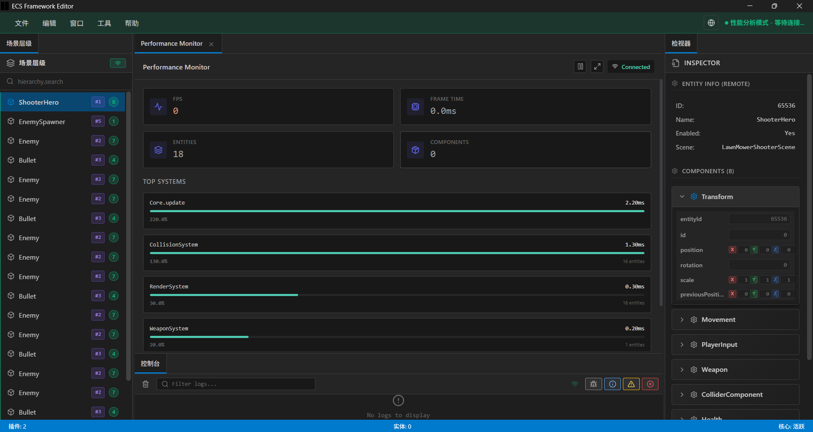

<h1 align="center">
  
  <br>
  ESEngine
</h1>

<p align="center">
  <strong>跨平台 2D 游戏引擎</strong>
</p>

<p align="center">
  <a href="https://www.npmjs.com/package/@esengine/ecs-framework"></a>
  <a href="https://github.com/esengine/esengine/blob/master/LICENSE"></a>
  <a href="https://github.com/esengine/esengine/stargazers"></a>
</p>

<p align="center">
  <a href="./README.md">English</a> | <b>中文</b>
</p>

<p align="center">
  <a href="https://esengine.github.io/ecs-framework/">文档</a> ·
  <a href="https://esengine.github.io/ecs-framework/api/">API 参考</a> ·
  <a href="https://github.com/esengine/esengine/releases">下载编辑器</a> ·
  <a href="./examples/">示例</a>
</p>

---

ESEngine 是一个跨平台 2D 游戏引擎，提供统一的开发界面。它包含完整的常用工具集，让开发者专注于游戏创作本身。

游戏可以导出到多个平台，包括 Web 浏览器、微信小游戏等小游戏平台。

## 免费开源

ESEngine 基于 MIT 协议完全免费开源。无附加条件，无版税。你的游戏完全属于你。

## 特性

- **数据驱动架构**：基于 ECS（实体-组件-系统）模式构建，提供灵活高效的游戏逻辑
- **高性能渲染**：Rust/WebAssembly 2D 渲染器，支持精灵批处理和 WebGL 2.0
- **可视化编辑器**：跨平台桌面编辑器，包含场景管理、资源浏览器和可视化工具
- **模块化设计**：按需使用，每个功能都是独立模块，可单独引入
- **多平台支持**：一套代码部署到 Web、微信小游戏等多个平台

## 获取引擎

### 通过 npm 安装

```bash
npm install @esengine/ecs-framework
```

### 从源码构建

详见 [从源码构建](#从源码构建) 章节。

### 编辑器下载

预编译的编辑器可在 [Releases](https://github.com/esengine/esengine/releases) 页面下载，支持 Windows 和 macOS。

## 快速开始

```typescript
import {
    Core, Scene, Entity, Component, EntitySystem,
    Matcher, Time, ECSComponent, ECSSystem
} from '@esengine/ecs-framework';

@ECSComponent('Position')
class Position extends Component {
    x = 0;
    y = 0;
}

@ECSComponent('Velocity')
class Velocity extends Component {
    dx = 0;
    dy = 0;
}

@ECSSystem('Movement')
class MovementSystem extends EntitySystem {
    constructor() {
        super(Matcher.all(Position, Velocity));
    }

    protected process(entities: readonly Entity[]): void {
        for (const entity of entities) {
            const pos = entity.getComponent(Position);
            const vel = entity.getComponent(Velocity);
            pos.x += vel.dx * Time.deltaTime;
            pos.y += vel.dy * Time.deltaTime;
        }
    }
}

Core.create();
const scene = new Scene();
scene.addSystem(new MovementSystem());

const player = scene.createEntity('Player');
player.addComponent(new Position());
player.addComponent(new Velocity());

Core.setScene(scene);

// 游戏循环
let lastTime = 0;
function gameLoop(currentTime: number) {
    const deltaTime = (currentTime - lastTime) / 1000;
    lastTime = currentTime;

    Core.update(deltaTime);
    requestAnimationFrame(gameLoop);
}
requestAnimationFrame(gameLoop);
```

## 模块

ESEngine 采用模块化组织。每个功能都有运行时模块和可选的编辑器扩展。

### 核心

| 包名 | 描述 |
|------|------|
| `@esengine/ecs-framework` | ECS 框架核心，包含实体管理、组件系统和查询 |
| `@esengine/math` | 向量、矩阵和数学工具 |
| `@esengine/engine` | Rust/WASM 2D 渲染器 |
| `@esengine/engine-core` | 引擎模块系统和生命周期管理 |

### 运行时模块

| 包名 | 描述 |
|------|------|
| `@esengine/sprite` | 2D 精灵渲染和动画 |
| `@esengine/tilemap` | Tilemap 渲染，支持动画 |
| `@esengine/physics-rapier2d` | 基于 Rapier 的 2D 物理模拟 |
| `@esengine/behavior-tree` | 行为树 AI 系统 |
| `@esengine/blueprint` | 可视化脚本运行时 |
| `@esengine/camera` | 相机控制和管理 |
| `@esengine/audio` | 音频播放 |
| `@esengine/ui` | UI 组件 |
| `@esengine/material-system` | 材质和着色器系统 |
| `@esengine/asset-system` | 资源加载和管理 |

### 编辑器扩展

| 包名 | 描述 |
|------|------|
| `@esengine/sprite-editor` | 精灵检视器和工具 |
| `@esengine/tilemap-editor` | 可视化 Tilemap 编辑器，支持笔刷工具 |
| `@esengine/physics-rapier2d-editor` | 物理碰撞体可视化和编辑 |
| `@esengine/behavior-tree-editor` | 可视化行为树编辑器 |
| `@esengine/blueprint-editor` | 可视化脚本编辑器 |
| `@esengine/material-editor` | 材质和着色器编辑器 |
| `@esengine/shader-editor` | 着色器代码编辑器 |

### 平台

| 包名 | 描述 |
|------|------|
| `@esengine/platform-common` | 平台抽象接口 |
| `@esengine/platform-web` | Web 浏览器运行时 |
| `@esengine/platform-wechat` | 微信小游戏运行时 |

## 编辑器

ESEngine 编辑器是基于 Tauri 和 React 构建的跨平台桌面应用。

### 功能

- 场景层级和实体管理
- 组件检视器，支持自定义编辑器
- 资源浏览器，支持拖放
- Tilemap 编辑器，支持绘制、填充、选择工具
- 行为树可视化编辑器
- 蓝图可视化脚本
- 材质和着色器编辑
- 内置性能分析器
- 多语言支持（英文、中文）

### 截图



## 支持的平台

| 平台 | 运行时 | 编辑器 |
|------|--------|--------|
| Web 浏览器 | 支持 | - |
| Windows | - | 支持 |
| macOS | - | 支持 |
| 微信小游戏 | 开发中 | - |
| Playable 可玩广告 | 计划中 | - |
| Android | 计划中 | - |
| iOS | 计划中 | - |
| Windows 原生 | 计划中 | - |
| 其他平台 | 计划中 | - |

## 从源码构建

### 前置要求

- Node.js 18 或更高版本
- pnpm 10 或更高版本
- Rust 工具链（用于 WASM 渲染器）
- wasm-pack

### 安装

```bash
# 克隆仓库
git clone https://github.com/esengine/esengine.git
cd esengine

# 安装依赖
pnpm install

# 构建所有包
pnpm build

# 构建 WASM 渲染器（可选）
pnpm build:wasm
```

### 运行编辑器

```bash
cd packages/editor-app
pnpm tauri:dev
```

### 项目结构

```
esengine/
├── packages/           引擎包（运行时、编辑器、平台）
├── docs/               文档源码
├── examples/           示例项目
├── scripts/            构建工具
└── thirdparty/         第三方依赖
```

## 文档

- [快速入门](https://esengine.github.io/ecs-framework/guide/getting-started.html)
- [架构指南](https://esengine.github.io/ecs-framework/guide/)
- [API 参考](https://esengine.github.io/ecs-framework/api/)

## 社区

- [GitHub Issues](https://github.com/esengine/esengine/issues) - Bug 反馈和功能建议
- [GitHub Discussions](https://github.com/esengine/esengine/discussions) - 问题和想法
- [QQ 交流群](https://jq.qq.com/?_wv=1027&k=29w1Nud6) - 中文社区

## 贡献

欢迎贡献代码。提交 PR 前请阅读贡献指南。

1. Fork 仓库
2. 创建功能分支
3. 修改代码并测试
4. 提交 PR

## 许可证

ESEngine 基于 [MIT 协议](LICENSE) 开源。
